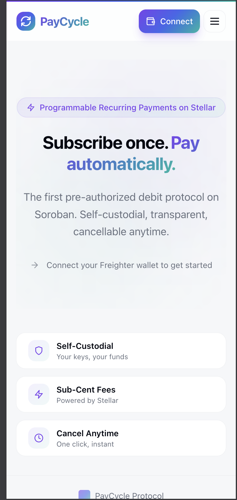
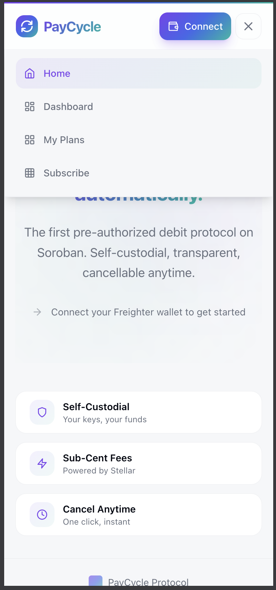

# PayCycle

[](https://github.com/Sandijigs/PayCycle/actions/workflows/ci.yml)

**Programmable Recurring Payments Protocol for Stellar**

PayCycle is a pre-authorized debit protocol built on Soroban smart contracts that brings subscription billing infrastructure to the Stellar ecosystem. Users approve a spending cap once, and payments flow automatically — fully self-custodial, transparent on-chain, and cancellable anytime.

```
User approves: "Up to 10 USDC per month to Merchant X"
    |
Contract auto-executes payment each cycle (if checks pass)
    |
User retains full custody until exact payment moment
    |
Cancel anytime with one click
```


---

## Live Demo & Media

| Resource | Link |
|----------|------|
| **Live Demo** | [paycycle.vercel.app](https://paycycle.vercel.app) |
| **Demo Video (1 min)** | [YouTube — PayCycle Demo](https://youtu.be/uOhB9rMPtSM) |
| **Subscription Contract** | [Stellar Expert](https://stellar.expert/explorer/testnet/contract/CBSG3PNVBSY32MOEEVYFVQPSOFSQGA5WEP3HTVX7YOXTSASWJ4TNT4KD) |
| **PLC Token Contract** | [Stellar Expert](https://stellar.expert/explorer/testnet/contract/CB6X6N4ZMBQPBPJIIQYK745BEN67WFRJVUXCJRQ64S23ZB5HT32IYHOB) |
| **Keeper Contract** | [Stellar Expert](https://stellar.expert/explorer/testnet/contract/CCYCHDQLVTYJZLMJ5F5MEGKESZMQABWDBDDWMNHJ5CKLHKEMESJX5DTA) |

### Deployed Contracts

| Contract | Address | Network |
|----------|---------|---------|
| Subscription | `CBSG3PNVBSY32MOEEVYFVQPSOFSQGA5WEP3HTVX7YOXTSASWJ4TNT4KD` | Testnet |
| PLC Token (SEP-41) | `CB6X6N4ZMBQPBPJIIQYK745BEN67WFRJVUXCJRQ64S23ZB5HT32IYHOB` | Testnet |
| Keeper | `CCYCHDQLVTYJZLMJ5F5MEGKESZMQABWDBDDWMNHJ5CKLHKEMESJX5DTA` | Testnet |
| XLM SAC | `CDLZFC3SYJYDZT7K67VZ75HPJVIEUVNIXF47ZG2FB2RMQQVU2HHGCYSC` | Testnet |

### Inter-Contract Call Proof

The Keeper contract orchestrates 5 inter-contract calls per payment cycle (see [architecture.md](docs/architecture.md)):

| Step | Contract Call | Purpose |
|------|-------------|---------|
| 1 | `subscription.get_subscription()` | Read subscriber + plan_id |
| 2 | `subscription.get_plan()` | Read merchant address |
| 3 | `subscription.execute_payment()` | Transfer tokens via `transfer_from` |
| 4 | `plc_token.mint(subscriber)` | Reward subscriber with PLC |
| 5 | `plc_token.mint(merchant)` | Reward merchant with PLC |

**Testnet token approval tx (cross-contract):** [`558137d0...`](https://stellar.expert/explorer/testnet/tx/558137d003dc063b929eb9cd352f0d0ba8270c2b473907e8189d6d35971182ae) — alice approves subscription contract to spend XLM via SAC.

The full 5-call keeper flow is validated by the 4 keeper integration tests (`cargo test -p pay_cycle_keeper`).

### Mobile Responsive UI

 

### Test Output

**Contract Tests (29 passing — 12 subscription + 13 token + 4 keeper):**


**Frontend Tests (26 passing):**


### CI/CD Pipeline


---

## Why PayCycle?

The $556 billion subscription economy has **zero native infrastructure** on Stellar. Every dApp that wants recurring payments must build billing from scratch — or go without recurring revenue entirely.

PayCycle solves this by providing a **protocol-level solution** that any Stellar dApp can integrate in under 50 lines of code, similar to what Stripe Billing does for traditional web applications.

**Key Differentiators:**

- **Self-Custodial** — Users retain full control of their funds. No escrow, no middlemen.
- **Sub-Cent Fees** — Built on Stellar's low-fee infrastructure (< $0.01 per transaction).
- **Cancel Anytime** — One-click cancellation with immediate effect, no lock-in periods.
- **On-Chain Transparency** — Every payment is verifiable on the Stellar ledger.

---

## Features

### Smart Contracts (Soroban/Rust)

**Subscription Contract:**

| Feature | Description |
|---------|-------------|
| Plan Management | Merchants create subscription plans with token, amount, and interval |
| Subscribe | Users subscribe with a spending cap (pre-authorized debit) |
| Execute Payment | Automated recurring payments with `transfer_from` pattern |
| Pause/Resume | Subscribers can pause and resume subscriptions |
| Cancel | One-click cancellation with immediate effect |
| Fee Collection | 0.5% protocol fee on each payment |
| Initialization | Admin-controlled setup with configurable fee collector |

**PLC Token Contract (SEP-41):**

| Feature | Description |
|---------|-------------|
| SEP-41 Compliant | Full token interface: transfer, approve, transfer_from, burn, burn_from |
| Metadata | name="PayCycle Token", symbol="PLC", decimals=7 |
| Admin Minting | Admin-controlled `mint` for reward distribution |
| Allowance System | Temporary storage with ledger-based expiration |
| TTL Management | Automatic TTL extension on balance and allowance access |

**Keeper Contract (Inter-Contract Calls):**

| Feature | Description |
|---------|-------------|
| Execute & Reward | 5 inter-contract calls: read subscription → read plan → execute payment → mint PLC to subscriber → mint PLC to merchant |
| Batch Execute | Loop through multiple subscription IDs, atomic all-or-nothing |
| Reward Config | Configurable PLC reward amounts for subscribers and merchants |

### Frontend (Next.js)

| Feature | Description |
|---------|-------------|
| Wallet Connection | Multi-wallet support via StellarWalletsKit (Freighter, xBull, Lobstr) |
| Dashboard | Role-based tabs (Merchant / Subscriber) with stat cards |
| Plan Creation | 3-step wizard for creating subscription plans |
| Subscribe Flow | Browse plans, subscribe with spending cap approval |
| Subscription Management | Pause, resume, cancel subscriptions with confirmation |
| Skeleton Loading | Animated skeleton states while data loads |
| React Query Caching | Plans cached 30s, subscriptions 15s, auto-invalidated on mutations |
| Toast Notifications | Success/error feedback on all actions via sonner |
| Error Boundary | Graceful crash recovery with "Try Again" |
| Activity Feed | Real-time protocol event feed via Soroban RPC `getEvents` polling |
| Event-Driven Refresh | Auto-invalidates caches when new contract events arrive |
| Mobile Responsive | Hamburger navigation, responsive stat grids, abbreviated addresses |
| CI/CD | GitHub Actions pipeline: contract tests, frontend tests, frontend lint |
| Vercel Deployment | Production-ready with environment variable configuration |

### Transaction Flow

```
[Merchant creates plan] → name, token, amount, interval
        |
[Subscriber subscribes] → approves spending cap
        |
[Payment execution] → transfer_from subscriber → merchant (net) + fee_collector (0.5%)
        |
[Subscriber manages] → pause / resume / cancel anytime
```

---

## Tech Stack

| Layer | Technology |
|-------|-----------|
| **Smart Contracts** | Rust, Soroban SDK v21.7.7 |
| **Frontend** | Next.js 14 (App Router), TypeScript, TailwindCSS |
| **Wallet Integration** | StellarWalletsKit v1.9.5 (Freighter, xBull, Lobstr) |
| **Stellar SDK** | @stellar/stellar-sdk v14.5.0 |
| **State Management** | React Query v5 (server state), React Context (wallet state) |
| **Notifications** | Sonner (toast notifications) |
| **Testing** | Vitest + @testing-library/react (frontend), `cargo test` (contract) |
| **Deployment** | Vercel (frontend), Stellar Testnet (contract) |

---

## Project Structure

```
paycycle/
├── contracts/
│   ├── subscription/
│   │   └── src/
│   │       ├── lib.rs           # Subscription contract (create_plan, subscribe, execute_payment, etc.)
│   │       ├── types.rs         # PlanData, SubscriptionData, PlanStatus, SubscriptionStatus
│   │       ├── errors.rs        # PayCycleError enum (12 error variants)
│   │       ├── events.rs        # Contract event definitions
│   │       └── test.rs          # 12 contract tests
│   ├── token/
│   │   └── src/
│   │       ├── lib.rs           # PLC token (SEP-41): mint, burn, transfer, approve, metadata
│   │       └── test.rs          # 13 token tests
│   └── keeper/
│       └── src/
│           ├── lib.rs           # Keeper: execute_and_reward, batch_execute (5 inter-contract calls)
│           └── test.rs          # 4 keeper integration tests
├── frontend/
│   └── src/
│       ├── app/
│       │   ├── layout.tsx       # Root layout with nav, error boundary, toaster
│       │   ├── page.tsx         # Landing page
│       │   ├── dashboard/       # Dashboard with merchant/subscriber tabs
│       │   ├── plans/           # Plan creation and management
│       │   └── subscribe/       # Browse plans, manage subscriptions
│       ├── components/
│       │   ├── wallet/          # WalletProvider, ConnectButton
│       │   ├── subscription/    # CreatePlanForm, SubscribeFlow, SubscriptionCard
│       │   ├── transaction/     # TxStatus
│       │   ├── ui/              # Reusable UI primitives (button, card, skeleton, etc.)
│       │   ├── ErrorBoundary.tsx
│       │   └── MobileNav.tsx
│       ├── hooks/
│       │   ├── useSubscription.ts     # Core Soroban contract interaction hook
│       │   ├── useContractQueries.ts  # React Query wrapper hooks + mutations
│       │   ├── useWallet.ts           # Wallet context consumer
│       │   ├── useBalance.ts          # Balance fetching with React Query
│       │   └── useTokenApproval.ts    # Token approval for recurring debits
│       ├── lib/
│       │   ├── contracts.ts     # Contract addresses and token config
│       │   └── stellar.ts       # Network configuration
│       ├── types/
│       │   └── subscription.ts  # TypeScript types, intervals, error parsing
│       └── __tests__/
│           └── components.test.tsx  # 26 frontend component tests
├── .github/workflows/ci.yml    # CI pipeline (contract + frontend tests)
└── README.md
```

---

## Getting Started

### Prerequisites

- **Node.js** >= 22.x
- **npm** >= 11.x
- **Rust** + `wasm32-unknown-unknown` target (for contract development)
- **Stellar CLI** (`stellar`) for contract deployment
- **Freighter Wallet** — [Install the browser extension](https://www.freighter.app/)

### Installation

```bash
# Clone the repository
git clone https://github.com/Sandijigs/PayCycle.git
cd PayCycle

# Install frontend dependencies
cd frontend
npm install

# Create environment file
cp .env.example .env.local
# Edit .env.local with your contract ID

# Start development server
npm run dev
```

The app will be available at `http://localhost:3000`.

### Environment Variables

Create a `.env.local` file in the `frontend/` directory:

```env
NEXT_PUBLIC_STELLAR_NETWORK=testnet
NEXT_PUBLIC_SOROBAN_RPC_URL=https://soroban-testnet.stellar.org
NEXT_PUBLIC_HORIZON_URL=https://horizon-testnet.stellar.org
NEXT_PUBLIC_NETWORK_PASSPHRASE=Test SDF Network ; September 2015
NEXT_PUBLIC_SUBSCRIPTION_CONTRACT_ID=<your-deployed-contract-id>
```

### Contract Development

```bash
# Build the contract
cd contracts/subscription
stellar contract build

# Run contract tests
cargo test

# Deploy to testnet
stellar contract deploy \
  --wasm target/wasm32v1-none/release/pay_cycle_subscription.wasm \
  --source <your-identity> \
  --network testnet

# Initialize the contract
stellar contract invoke \
  --id <contract-id> \
  --source <your-identity> \
  --network testnet \
  -- initialize \
  --admin <admin-address> \
  --fee_bps 50 \
  --fee_collector <fee-collector-address>
```

### Running Tests

```bash
# Frontend tests (26 tests)
cd frontend
npx vitest run

# Contract tests (12 tests)
cd contracts/subscription
cargo test
```

### Freighter Setup

1. Install the [Freighter browser extension](https://www.freighter.app/)
2. Create or import a Stellar wallet
3. **Switch to Test Net** — Open Freighter > Settings > Network > Select "Test Net"
4. Connect your wallet through the PayCycle interface
5. Fund your testnet account using Friendbot

---

## Architecture

### Smart Contract Design

The subscription contract uses **instance storage** with composite keys for efficient data organization:

```
Storage Keys:
  "admin"           → Address (protocol admin)
  "fee_bps"         → u32 (fee in basis points, e.g. 50 = 0.5%)
  "fee_col"         → Address (fee collector)
  "plan_cnt"        → u64 (total plan count)
  "sub_cnt"         → u64 (total subscription count)
  ("plan", id)      → PlanData
  ("sub", id)       → SubscriptionData
  ("user_subs", addr) → Vec<u64> (user's subscription IDs)
```

**Payment Flow:**
```
execute_payment(subscription_id)
    |
    ├── Verify subscription is Active
    ├── Verify payment is due (current_time >= next_payment)
    ├── Load plan and verify it's Active
    ├── Check amount <= spending cap
    ├── Calculate fee (amount * fee_bps / 10000)
    ├── transfer_from(subscriber → merchant, net_amount)
    ├── transfer_from(subscriber → fee_collector, fee_amount)
    └── Update next_payment = current_time + interval
```

### Frontend Architecture

```
Providers (QueryClient + Wallet)
    |
    ├── useSubscription()           # Low-level contract calls (invoke/query)
    ├── useContractQueries()        # React Query wrappers with caching
    │   ├── useMerchantPlans()      # staleTime: 30s
    │   ├── useAllActivePlans()     # staleTime: 30s
    │   ├── useUserSubscriptions()  # staleTime: 15s
    │   └── Mutations (auto-invalidate on success)
    └── Pages consume hooks directly
```

---

## Security Considerations

- **Self-custodial** — No private keys are stored or transmitted. All signing happens in the wallet extension.
- **Spending caps** — Subscribers set a maximum amount per payment, preventing overcharging.
- **Input validation** — All addresses validated before transaction construction.
- **Balance guards** — App reserves funds for network fees and minimum balance.
- **Network isolation** — Configured for Testnet with explicit passphrase verification.
- **Graceful error handling** — Contract query failures return empty data instead of crashing the UI.

---

## Roadmap

| Belt | Focus | Status |
|------|-------|--------|
| **White Belt** | Wallet integration, XLM transfers, testnet setup | Done |
| **Yellow Belt** | Soroban smart contract, subscription contract v1 | Done |
| **Orange Belt** | Dashboard, plan management, caching, deployment | Done |
| **Green Belt** | PLC token (SEP-41), keeper contract, inter-contract calls, CI/CD, mobile responsive | Done |
| **Blue Belt** | Full MVP, 5+ testnet users, feedback, iteration | In Progress |
| **Black Belt** | Mainnet launch, security audit, analytics | Planned |

---

## User Feedback & Validation (Blue Belt)

### Testnet Users

5 real users tested PayCycle on Stellar Testnet. All wallet addresses are verifiable on [Stellar Expert](https://stellar.expert/explorer/testnet).

See full details: [docs/testnet-users.md](docs/testnet-users.md)

### Feedback Collection

Feedback was collected via [Google Form](https://forms.gle/EEbHGKuBsodKgPhz7).

Exported responses: [docs/user-feedback-responses.csv](docs/user-feedback-responses.csv)

Full feedback report: [docs/user-feedback.md](docs/user-feedback.md)

| Question | Average Score |
|----------|---------------|
| Ease of use | 4.4 / 5 |
| Trust in payment model | 4.4 / 5 |
| Transaction speed | 4.4 / 5 |
| Overall rating | 5.0 / 5 |

### Improvements Based on Feedback

**Issue:** Trust in the pre-authorized payment model scored lowest (min 3/5). Users entering via shared plan links had no context about how spending caps and self-custody protect them before starting the subscribe flow.

**What we changed:** Added a "How It Works" trust explainer section to the shareable plan page (`/plan/[id]`) that explains spending caps, self-custody, and instant cancellation step-by-step — so subscribers understand the safety model before they commit.

**Improvement commit:** [`PENDING`] — will be updated with commit hash after push

### Next Phase Plans

Based on feedback from User 2 ("more features needed for mainnet"), the next phase will focus on:
- Multi-token payment support (USDC alongside XLM)
- Payment history and analytics dashboard
- Email/webhook notifications for merchants
- Mainnet deployment with security audit

---

## Contributing

Contributions are welcome. Please open an issue to discuss proposed changes before submitting a pull request.

```bash
# Development
cd frontend && npm run dev

# Tests
npx vitest run          # Frontend
cargo test              # Contract

# Lint
npm run lint

# Type check
npx tsc --noEmit
```

---

## License

This project is licensed under the MIT License — see the [LICENSE](LICENSE) file for details.

---

Built on [Stellar](https://stellar.org) | Powered by [Soroban](https://soroban.stellar.org) | [GitHub](https://github.com/Sandijigs/PayCycle)
